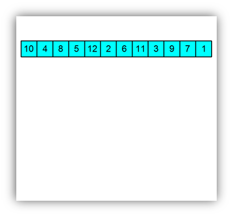

# Sortovací algorytmy - Tomáš Vik
***
## Obsah
- [Sortovací algorytmy](#sortovací-algorytmy)
- [Bubble sort](#bubble-sort)
- [Insertion sort](#insertion-sort)
- [Selection sort](#selection-sort)
- [Merge sort](#merge-sort)
- [Quick sort](#quick-sort)
- [Heap sort](#heap-sort)
- [Counting sort](#counting-sort)

***

### Sortovací algorytmy
#### Popis
* Sortovací algorytmy jsou metody, které slouží k řazení dat v pořadí
podle určitého kritéria.
* Existuje mnoho různých sortovacích algoritmů, které se liší v rychlosti, 
využití paměti a vlastnostech.
#### Přístup
* Zvolil jsem jazyk c++, protože se ho chci lépe naučit.
* Funkce používají pointery takže jsou void a nic nevrací.

<hr>

### Selection sort
#### Popis
* Selection sort je jednoduchý sortovací algoritmus, který prochází pole dat a vybírá nejmenší prvek, který pak přesouvá na začátek pole.
* Poté pokračuje v procházení pole a opět vybírá nejmenší prvek a přesouvá ho na druhou pozici.
* Tento process se opakuje dokud není pole seřazeno.
#### Časová složitost
* O(n^2)
#### Výhody
* Je velmi jednoduchý na pochopení a na implementaci.
* Je stabilní, prvky se stejnou hodnotou zůstanou v původním pořadí.
#### Nevýhody
* Není vhodný pro velká data, protože je pomalý.
#### Implementace
```c++
void SelectionSort(int* arr, int numElements) {
    // Projde array až na poslední prvek.
    for(int i = 0; i < numElements - 1; i++) { 
        // Nastaví index nejmenšího prvku.
        int minIndex = i; 
        // Projde array od i + 1 až na konec.
        for(int j = i + 1; j < numElements; j++) { 
            // Pokud je prvek na pozici j menší než minIndex take je to nový minIndex.
            if(arr[j] < arr[minIndex]) { 
                minIndex = j;
            }
        }
        std::swap(arr[i], arr[minIndex]);
    }
}
```
<hr>

### Bubble sort
#### Popis
* Bubble sort je jednoduchý sortovací algoritmus, který se postupně
  prochází pole a porovnává dva sousední prvky a pokud je první
  větší než druhý, tak je prohodí.
* Algoritmus se opakuje dokud není pole seřazeno.
#### Časová složitost
* O(n^2)
#### Výhody
* Je velmi jednoduchý na pochopení a na implementaci
* Je stabilní, prvky se stejnou hodnotou zůstanou v původním pořadí.
#### Nevýhody
* Není vhodný pro velká data, protože je pomalý.
* Je velmi náročný na paměť.
#### Optimalizace
* Pokud se v průběhu algoritmu neprovede žádná prohození, tak je pole
  již seřazeno a algoritmus se ukončí.

#### Implementace
```c++
void BubbleSort(int* arr, int numElements) {
    // Cyklus projde array až na poslední prvek.
    for(int i = 0; i < numElements - 1; i++) {
        // Proměnná pro kontrolu, zda je pole již seřazeno.
        bool isSorted = true;
        for(int j = 0; j < numElements - i - 1; j++) {
            // Pokud je prvek na pozici j větší než prvek na pozici j + 1 
            // tak je potřeba je prohodit.
            if(arr[j] > arr[j + 1]) { 
                std::swap(arr[j], arr[j + 1]);
                isSorted = false;
            }
        }
        // Pokud je array seřazený tak se cyklus ukončí.
        if(isSorted) { 
            break;
        }
    }
}
```

<hr>

### Insertion sort
#### Popis
* Insertion sort je jednoduchý sortovací algoritmus, který prochází pole dat a pro 
každý prvek v poli ho vkládá na správné místo v již seřazené části pole.
* Tento process se opakuje dokud není pole seřazeno.
#### Časová složitost
* O(n^2)
#### Výhody
* Je velmi jednoduchý na pochopení a na implementaci.
* Je stabilní, prvky se stejnou hodnotou zůstanou v původním pořadí.
#### Nevýhody
* Není vhodný pro velká data, protože je pomalý.
#### Implementace
```c++
void InsertionSort(int* arr, int numElements)
{
    // Projde array od druhého prvku až na konec.
    for(int i = 1; i < numElements; i++) { 
        // Nastaví index na prvek před i.
        int j = i - 1; 
        // Nastaví klíč na prvek na pozici i.
        int key = arr[i]; 
        // Pokud je prvek na pozici j větší než klíč tak se posune na pozici j + 1.
        while(j >= 0 && arr[j] > key) { 
            arr[j + 1] = arr[j];
            j--;
        }
        // Nastaví klíč na pozici j + 1.
        arr[j + 1] = key; 
    }
}
```
***

### Heap(Halda) sort
#### Popis
* Halda se dá prohledat pomocí výpočtu pozic dětí a rodičů.
  * Rodič se najde pomocí : (x - 1) / 2 (x = kurentní pozice v datech)
  * Dítě se nade pomocí : (x * 2) + 1 nebo (x * 2) + 2 
* V prvním kroku se sestaví halda neboli heap a najde se největší číslo.
* Ve druhém kroku se vytvoří setříděné pole opakovaným odebráním největšího prvku z haldy a jeho vložením do pole.
* Halda je aktualizována po každém odebrání, aby byla zachována vlastnost haldy.
* Po odstranění všech objektů z haldy je výsledkem seřazené pole.

#### Časová složitost
* O(n log n)
#### Výhody
* Je velmi rychlý.
* Je stabilní, prvky se stejnou hodnotou zůstanou v původním pořadí.
* Je vhodný pro velká data.
#### Nevýhody
* Halda je náročná na paměť.
* Je složitý na pochopení a na implementaci.
* Je neefektivní pro malá data.
#### Implementace
```c++
void Down(int* arr, int last) {
    //Vytvoříme indexi.
    int child;
    int parent = 0;

    //Dokud není dítě poslední a je větší než rodič tak se budeme posouvat dolů.
    while (parent * 2 + 1 <= last) {
        //Vytvoříme dítě.
        child = parent * 2 + 1;
        //Vybereme větší ze dvou dětí.
        if ((child < last) && (arr[child] < arr[child + 1]))
            child++;
        //Jestli je dítě větší než rodič tak je potřeba je prohodit.
        if (arr[parent] < arr[child]) {
            //Prohodíme dítě a rodiče.
            std::swap(arr[parent], arr[child]);
            //Dítě se stává rodičem.
            parent = child;
        }
        else
            return;
    }
}

void Heapify(int *arr, int numElements)
{
    //Vytvoříme heap.
    for (int i = 1; i < numElements; i++) {
        //Vytvoříme indexi.
        int child = i;
        int parent;
        //Dokudnení dítě 0 a je větší než rodič tak se budeme posouvat nahoru.
        while (child != 0) {
            //Vytvoříme rodiče.
            parent = (child - 1) / 2;
            //Pokud je dítě větší než rodič tak je potřeba je prohodit.
            if (arr[parent] < arr[child]) {
                //Prohodíme dítě a rodiče.
                std::swap(arr[parent], arr[child]);
                //Dítě se stává rodičem.
                child = parent;
            }
            //Pokud není dítě větší než rodič tak se cyklus ukončí.
            else
                break;
        }
    }
}

void HeapSort(int *arr, int numElements)
{
    //Vytvoření heapu.
    Heapify(arr, numElements);
    //Nastavíme index na poslední prvek.
    int index = numElements - 1;
    //Cyklus se opakuje dokud je index větší než nula.
    while (index > 0) {
        //Prohodíme první a poslední prvek.
        std::swap(arr[0], arr[index]);
        //Zmenšíme index.
        index -= 1;
        //Projdeme heap ze zhora dolů.
        Down(arr, index);
    }
}
```

<hr>

### Merge sort
#### Popis
* Merge sort je trochu víc komplikovaný sortovací algoritmus, který funguje tak, že prochází pole dat a rozděluje je na poloviny. 
* Poté co jsou všechny data rozděleny tak je začne porovnávat a slévat zpátky do sebe.
* Poté co se všechno rozdělí na podsez začnou tyto podseznamy postupně slučovat do větších a větších seřazených podseznamů, dokud celý seznam není seřazen.
* Slévání je klíčovou částí algoritmu Merge sortu.
  * Slévání se provádí tak, že vezmeme dva sousední podseznamy a postupně je porovnáváme prvek po prvku a vkládáme je do nového seznamu v seřazeném pořadí. Takže první prvek z prvního podseznamu a první prvek z druhého podseznamu se porovnají a menší prvek se vloží do nového seznamu.
  * Tento proces se opakuje pro každý další prvek, dokud se oba podseznamy nevyčerpají. Poté se zbytek prvků z nevyčerpaného podseznamu vloží na konec nového seznamu.
#### Časová složitost
* O(n log n)
#### Výhody
* Je rychlý.
* Je stabilní, prvky se stejnou hodnotou zůstanou v původním pořadí.
* Je vhodný pro velká data.
#### Nevýhody
* Je složitý na pochopení a na implementaci.
* Je neefektivní pro malá data.
* Je náročný na paměť.
#### Implementace
```c++
void Merge(int *arr, int start, int middle, int end) {
    int leftSize = middle - start + 1;
    int rightSize = end - middle;

    // Rozdělení pole na dvě části.
    int left[leftSize];
    int right[rightSize];

    // Naplníme pole.
    for (int i = 0; i < leftSize; i++)
        left[i] = arr[start + i];
    for (int i = 0; i < end - middle; i++)
        right[i] = arr[middle + 1 + i];

    // Vytváříme nové indexi.
    int arrIndex = start;
    int rightIndex = 0, leftIndex = 0;

    // Dokud jsou v obou polích prvky.
    while (leftIndex < leftSize && rightIndex < rightSize) {
        // Co se sleje první?
        if (left[leftIndex] >= right[rightIndex]) {
            // Levé pole se sleje do nového pole a posune se o jeden index.
            arr[arrIndex] = left[leftIndex];
            leftIndex++;
            arrIndex++;
        } else {
            // Pravé pole se sleje do nového pole a posune se o jeden index.
            arr[arrIndex] = right[rightIndex];
            rightIndex++;
            arrIndex++;
        }
    }

    // Doslévání.
    while (leftIndex < leftSize) {
        // Levé pole se sleje do nového pole a posune se o jeden index.
        arr[arrIndex] = left[leftIndex];
        leftIndex++;
        arrIndex++;
    }
    while (rightIndex < rightSize) {
        // Pravé pole se sleje do nového pole a posune se o jeden index.
        arr[arrIndex] = right[rightIndex];
        rightIndex++;
        arrIndex++;
    }
}

void MergeSort(int *array, int start, int end) {
    // Pokud je start větší než konec tak se rekurze ukončí.
    if (start >= end)
        return;

    // Vypočítáme střed.
    int middle = (start + end) / 2;

    // Děláme rekurzi na levou část.
    MergeSort(array, start, middle);
    // Děláme rekurzi na pravou část.
    MergeSort(array, middle + 1, end);

    // Sléváme pole.
    Merge(array, start, middle, end);
}
```

<hr>

### Quick sort
#### Popis
* Quick sort je jednoduchý sortovací algoritmus, který funguje na principu pivotů, které určují sortovací směr.
* V prvním kroku se vybere pivot, který je větší než všechny prvky nalevo od něj a menší než všechny prvky napravo od něj.
* Ve druhém kroku se pole rozdělí na dvě části, jedna bude obsahovat prvky menší než pivot a druhá bude obsahovat prvky větší než pivot.
* V třetím kroku se provede rekurze na obě části.
* Výsledkem je seřazené pole.
#### Časová složitost
* O(n log n)
#### Výhody
* Je rychlý.
* Je stabilní, prvky se stejnou hodnotou zůstanou v původním pořadí.
* Je vhodný pro velká i malá data.
* Je jednoduchý na pochopení a na implementaci.
#### Nevýhody
* Je náročný na paměť.
* Je neefektivní pro data s velkým rozmezím.
#### Implementace
```c++
int Divide(int* list, int left, int right, int pivot) {
    //Prohodíme pivot s pravým indexem.
    std::swap(list[pivot], list[right]);
    //Nastavíme nový pivot.
    int i = left;
    //Projdeme pole.
    for (int j = left; j < right; j++) {
        //Pokud je vybrané pole menší než pivot tak se prohodí.
        if (list[j] < list[right]) {
            //Prohodíme prvky.
            std::swap(list[i], list[j]);
            //Zvýšíme index.
            i++;
        }
    }
    //Prohodíme pivot s pravým indexem.
    std::swap(list[i], list[right]);
    //Vrátíme nový pivot.
    return i;
}

void Quicksort(int* arr, int left, int right) {
    //Pokud je levý index menší než pravý tak se cyklus opakuje.
    if (right >= left) {
        //Nastavíme pivot na levý index.
        int pivot = left;
        //Nastavíme nový pivot.
        int newPivot = Divide(arr, left, right, pivot);
        //Zavoláme funkci pro levou a pravou část.
        Quicksort(arr, left, newPivot - 1);
        Quicksort(arr, newPivot + 1, right);
    }
}
```

<hr>

### Counting sort
#### Popis
* Counting sort je jednoduchý sortovací algorytmus, který funguje na principu počítání výskytu prvků.
* V prvním kroku se projde pole a zjistí se maximální hodnota.
* V druhém kroku se vytvoří pole o velikosti maximální hodnoty.
* V třetím kroku se projde pole a zjistí se počet výskytů prvků.
* V čtvrtém kroku se projde pole a zjistí se počet výskytů prvků menších než aktuální prvek.
* V pátém kroku se projde pole a vloží se prvky do nového pole.
#### Časová složitost
* O(n + k) 
  * _**k** je maximální hodnota v poli._
#### Výhody
* Je rychlý.
* Je stabilní, prvky se stejnou hodnotou zůstanou v původním pořadí.
* Je vhodný pro velká i malá data.
* Je jednoduchý na pochopení a na implementaci.
#### Nevýhody
* Je náročný na paměť.
* Je neefektivní pro data s velkým rozmezím.
* Je neefektivní pro data s hodnotami menšími než 0.
#### Implementace
```c++
void CountingSort(int *arr, int numElements) {
    //Zjistíme maximální a minimální hodnotu.
    int max = *std::max_element(arr, arr + numElements);
    int min = *std::min_element(arr, arr + numElements);
    //Vypočítáme rozsah.
    int range = max - min + 1;
    //Vytvoříme pole pro počítání.
    int *count = new int[range]();
    //Vytvoříme pole pro výstup.
    int *output = new int[numElements]();
    //Pro každý prvek zvýšíme počet.
    for (int i = 0; i < numElements; i++)
        count[arr[i] - min]++;
    //Spočítáme počet prvků menších než aktuální.
    for (int i = 1; i < range; i++)
        count[i] += count[i - 1];
    //Vytvoříme výstup.
    for (int i = numElements - 1; i >= 0; i--) {
        output[count[arr[i] - min] - 1] = arr[i];
        count[arr[i] - min]--;
    }
    //Zkopírujeme výstup do pole.
    for (int i = 0; i < numElements; i++)
        arr[i] = output[i];
}
```

## Zdroje
* [Bubble Sort](https://moodle.sspbrno.cz/pluginfile.php/7442/mod_resource/content/3/Algoritmizace_BubbleSort_v2.pdf) - moodle.sspbrno.cz [online]. [cit. 16.02.2023].
* [Heap Sort Example GIF](https://commons.wikimedia.org/wiki/File:Heap_sort_example.gif)  - Wikimedia Commons. [online].
* [Merge Sort](https://www.itnetwork.cz/algoritmy/razeni/algoritmus-merge-sort-trideni-cisel-podle-velikosti) - 
itnetwork.cz - Učíme národ IT [online]. Copyright © 2023 itnetwork.cz. Veškerý obsah webu [cit. 16.02.2023].
* [Quick Sort](https://www.itnetwork.cz/algoritmy/razeni/algoritmus-quick-sort-razeni-cisel-podle-velikosti) - 
itnetwork.cz - Učíme národ IT [online]. Copyright © 2023 itnetwork.cz. Veškerý obsah webu [cit. 16.02.2023].


